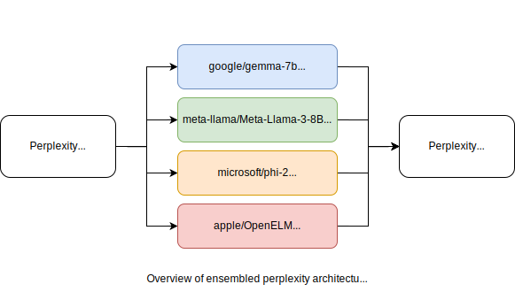

# Ensembled Perplexity API

Perplexity is a measure of the likelihood of a given string, usually as judged by the probabilities output by a language model. For more details, see this [HuggingFace explanation of perplexity](https://huggingface.co/docs/transformers/perplexity).

Many scenarios rely on having a good estimate of the "readability" or "likelihood" of a given string, to which perplexity is often the default metric to turn to. However, the perplexity calculated from the logits of a single model are often quite noisy, prone to the specifics of the training data ingested into the model.

Ensembled perplexity is more robust. By querying multiple language models for their respective logits, ensembled perplexity averages away the individual noise within each model, giving a more human interpretable metric of text likelihood.

## Overview
This repo implements a Python and HTTP API to calculate perplexity for an ensemble of language models.



Each language model is hosted using VLLM and distributed to a dedicated GPU on a separate process for maximum throughput. A central controller script distributes input prompts to each GPU, and colates the results back through the API.

## Installation
To get started, first create a conda enviroment:
```
conda create -n ensembled-perplexity python=3.10
```

Then, clone the repo and install the necessary required packages:
```
git clone https://github.com/haizelabs/ensembled-perplexity.git
cd ensembled-perplexity
pip install -r requirements.txt
```

Start the API server with
```
uvicorn perplexity_server:app
```

Navigate to `localhost:8000` to access the API and documentation.

## Hosted API Access
If you'd like to avoid the difficulty of provisioning and managing GPU infrastructure, Haize Labs maintains a dedicated cluster for ensembled perplexity.

Send us an email at contact@haizelabs.com and we'd be happy to grant you access.

## Performance

Below are performance stats running `lmsys/vicuna-7b-v1.5`, `meta-llama/Llama-2-7b-hf`, `microsoft/phi-2`, `mistralai/Mistral-7B-v0.1` on 4x L4 24GB GPUs.

| Number of 50 token prompts | Runtime (seconds) |
| ---------------------------| ----------------- |
| 1                          | 0.38              |
| 10                         | 0.48              |
| 100                        | 2.16              |
| 1000                       | 19.95             |

Quantized models may offer better performance on low memory GPUs.

## Contact

If you have any questions, comments, or would like to get in touch, reach out to contact@haizelabs.com.


